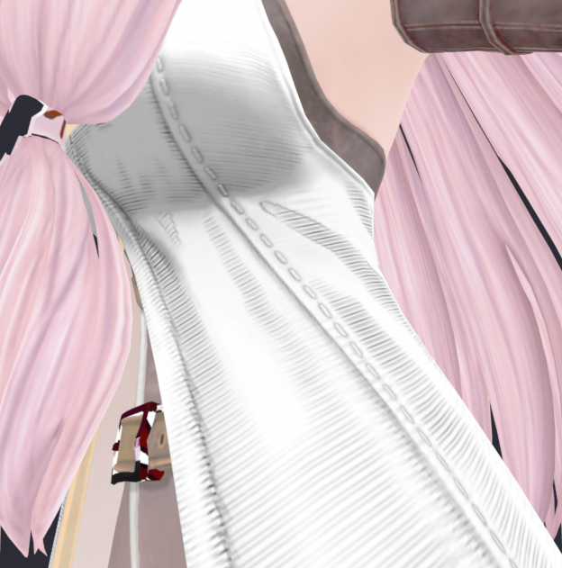
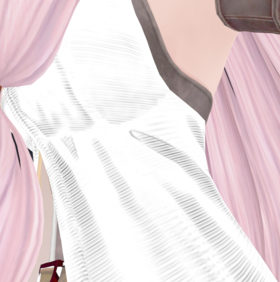
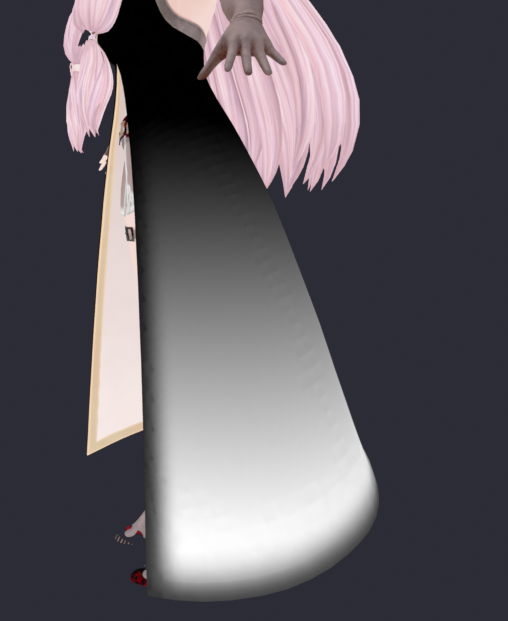

材质类型5子类型7下（正常金属）
修改一切描边开关都无法取消

材质类型4子7（Hair）
颜色发亮

稳妥的材质方案是复制一个衣服的材质的所有属性过来一模一样
由于双面渲染不知道怎么实现，twoside参数也只存在于特殊的植被特效shader上
> 故尽量把单面挤出成双面
如果需要cutout材质
依旧是5 7材质类型
shadow_type = 1 (ShadowEnable_Unk1)
ignore_alpha = false
bool12 = false (shadow_type = 3才开)
0x53F49792 = 1
0xA6EB1B34 = 0 (特殊金属的裁切才开)

对于msk的制作
> msk1不会做就默认 0.5 0.5 1 1(粗糙度 厚度 固定阴影 次级AO)
> msk3不会做就默认 0.5 1 1 1(曲率 内描边遮罩 未知白 未知白)
> 脸部msk4不会做就默认0 1 0 1(b为腮红遮罩，腮红为白)
> 脸部msk5不会做就默认0.5 0 0 1(r为描边宽度遮罩，可以给眼眶嘴全黑)

msk1 R 粗糙度？默认1没有光影区域硬度变化
msk1 G 厚度（有法线强度/高度的厚度）默认0无厚度
msk1 B 固定阴影（顶光light光影、拉硬的AO做min）默认1无阴影

msk1 A 次级AO（只有纹理质感部分，没有AO的黑，甚至把AO黑的地方排除了，近景叠加时不会多重压暗）默认1无阴影

msk3 R 曲率
msk3 G 内描边遮罩？（边缘黑的防止）

msk3 B 无信息-白
msk3 A 无信息-白

mesh、minfo、skeleton必须一起替换，否则会炸面
